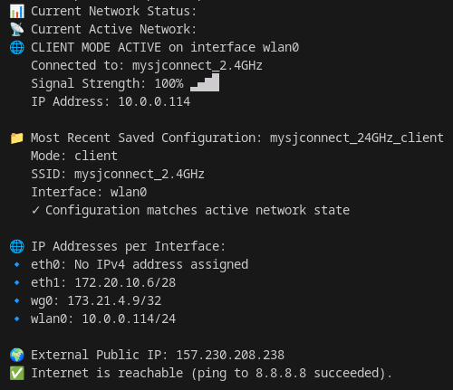

# 🌟 WORK-HIVE Network Manager

A powerful command-line tool for easily managing network connections on Linux systems, with special focus on WiFi hotspot and client modes with WireGuard VPN support.



## 🚀 Features

- **Dual-mode Operation**: Switch between hotspot and client mode with a single command
- **WireGuard VPN Integration**: Seamlessly connect and route traffic through WireGuard
- **Interactive Setup**: User-friendly wizard for easy configuration
- **Configuration Management**: Save, select, and reuse network configurations
- **Detailed Network Status**: Comprehensive view of your network state
- **Device Whitelisting**: Control which devices can access your hotspot
- **Captive Portal Support**: Force DNS queries through your system
- **Diagnostics Tools**: Debug network issues with detailed information

## 📋 Requirements

- NetworkManager
- WireGuard tools (for VPN functionality)
- Linux system with Bash
- Standard networking utilities (nmcli, ip, ping, etc.)

## 🛠️ Installation

1. Clone this repository:
   ```bash
   git clone https://github.com/nfodor/work-hive.git
   cd work-hive